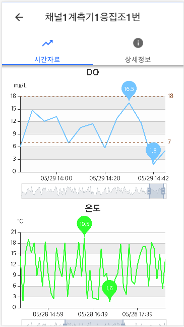
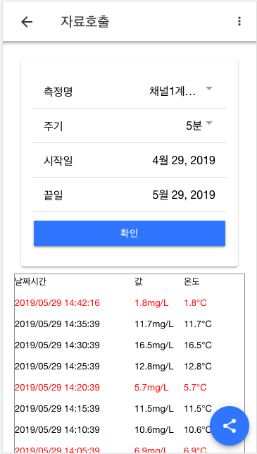

# Application

**대윤계기산업(주) 모바일 수질 모니터링 앱**

## Table of Contents
- [Getting Started](#getting-started)
- [App Preview](#app-preview)
- [Deploying](#deploying)
  - [Progressive Web App](#progressive-web-app)
  - [Android](#android)
  - [iOS](#ios)

## Getting Started

* [Download the installer](https://nodejs.org/) for Node.js 6 or greater.
* Install the ionic CLI globally: `npm install -g ionic`
* Clone this repository: `git clone https://github.com/ionic-team/ionic-conference-app.git`.
* Run `npm install` from the project root.
* Run `ionic serve` in a terminal from the project root.
* Profit. :tada:

_Note: See [How to Prevent Permissions Errors](https://docs.npmjs.com/getting-started/fixing-npm-permissions) if you are running into issues when trying to install packages globally._

## App Preview

앱 스크린 샷

- [Chart Page](https://gitlab.com/dymeter/application/blob/master/src/app/layout/detail/components/chart/chart.component.html)
  

- [TimeSeries Page](https://gitlab.com/dymeter/application/blob/master/src/app/layout/timeseries/timeseries.page.html)
  

- To see more images of the app, check out the [screenshots directory](https://gitlab.com/dymeter/application/tree/master/resources/screenshots)!

## Deploying

### Progressive Web App

1. Un-comment [these lines](https://github.com/ionic-team/ionic2-app-base/blob/master/src/index.html#L21)
2. Run `npm run ionic:build --prod`
3. Push the `www` folder to your hosting service

### Android

1. Run `ionic cordova run android --prod`

### iOS

1. Run `ionic cordova run ios --prod`
